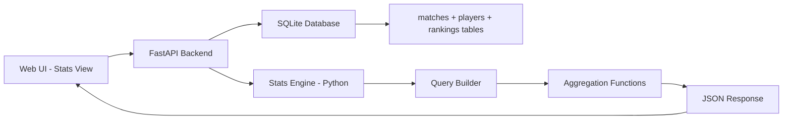

# Tennis Stats Feature Implementation Plan

## Overview
Add a "Stats Explorer" feature to the web UI that displays interesting tennis statistics using existing data in the database. This will support the types of analyses shown in the examples.

---

## Architecture

### System Flow


### Component Structure
```
deploy_temp/web-ui/src/
├── components/
│   └── StatsExplorer.jsx      # NEW: Main stats component
├── App.jsx                     # Add stats view routing

api.py                         # Add /api/stats/* endpoints
stats_engine.py                # NEW: Stats calculation module
```

---

## Phase 1: Backend API Endpoints

### New File: `stats_engine.py`
Create a dedicated module for statistics calculations.

```python
# stats_engine.py
import sqlite3
from datetime import datetime, timedelta
from collections import defaultdict

def get_db_connection():
    conn = sqlite3.connect('tennis_data.db')
    conn.row_factory = sqlite3.Row
    return conn

class TennisStatsEngine:
    def __init__(self):
        self.conn = get_db_connection()
    
    # ============================================
    # STREAK ANALYTICS
    # ============================================
    
    def get_consecutive_streaks(self, tour='wta', tourney_level='PM', start_year=2009):
        """
        Find consecutive opening match wins at specific tournament level.
        Supports: WTA-1000 streaks, etc.
        
        Args:
            tour: 'wta' or 'atp'
            tourney_level: 'PM' for WTA-1000, 'M' for Masters, etc.
            start_year: Year to start counting from
        """
        c = self.conn.cursor()
        
        # Get all opening round matches at this level
        c.execute("""
            SELECT m.winner_id, m.date, m.tournament, w.name as winner_name
            FROM matches m
            JOIN players w ON m.winner_id = w.player_id
            WHERE m.source LIKE ?
              AND m.tourney_level = ?
              AND m.date >= ?
              AND m.round IN ('R128', 'R64', 'R32')
            ORDER BY w.name, m.date ASC
        """, (f'sackmann-{tour}%', tourney_level, f'{start_year}-01-01'))
        
        matches = c.fetchall()
        
        # Group by player and calculate streaks
        player_matches = defaultdict(list)
        for m in matches:
            player_matches[m['winner_id']].append(m)
        
        results = []
        for player_id, player_match_list in player_matches.items():
            # Sort by date and count consecutive opening wins
            # (Complex streak logic here)
            max_streak = self._calculate_max_streak(player_match_list)
            if max_streak >= 10:  # Only notable streaks
                results.append({
                    'player_id': player_id,
                    'player_name': player_match_list[0]['winner_name'],
                    'streak': max_streak,
                    'category': f'{tour.upper()}-1000 Opening Matches'
                })
        
        return sorted(results, key=lambda x: x['streak'], reverse=True)[:20]
    
    # ============================================
    # AGE-BASED RECORDS
    # ============================================
    
    def get_age_records(self, tour='wta', min_age=40, tourney_levels=['PM', 'M', '1']):
        """
        Find match winners above a certain age at Tier I/WTA-1000 events.
        """
        c = self.conn.cursor()
        
        level_placeholders = ','.join(['?' for _ in tourney_levels])
        
        c.execute(f"""
            SELECT w.name, w.birth_date, m.date, m.tournament, 
                   m.tourney_level, m.winner_id,
                   CAST((julianday(m.date) - julianday(w.birth_date)) / 365.25 AS INTEGER) as age
            FROM matches m
            JOIN players w ON m.winner_id = w.player_id
            WHERE m.source LIKE ?
              AND m.tourney_level IN ({level_placeholders})
              AND w.birth_date IS NOT NULL
              AND (julianday(m.date) - julianday(w.birth_date)) / 365.25 >= ?
            ORDER BY age DESC
        """, [f'sackmann-{tour}%'] + tourney_levels + [min_age])
        
        results = []
        for row in c.fetchall():
            results.append({
                'player_name': row['name'],
                'age': row['age'],
                'date': row['date'],
                'tournament': row['tournament'],
                'category': 'Tier I/WTA-1000 Win at Age 40+'
            })
        
        return results
    
    # ============================================
    # TOURNAMENT CATEGORY WINS
    # ============================================
    
    def get_category_win_leaders(self, tour='wta', tourney_levels=['P', 'A'], 
                                  start_date='2025-01-01', limit=10):
        """
        Find players with most wins at specific tournament level since date.
        Supports: WTA-500 wins, etc.
        """
        c = self.conn.cursor()
        
        level_placeholders = ','.join(['?' for _ in tourney_levels])
        
        c.execute(f"""
            SELECT w.name, w.player_id, COUNT(*) as wins
            FROM matches m
            JOIN players w ON m.winner_id = w.player_id
            WHERE m.source LIKE ?
              AND m.tourney_level IN ({level_placeholders})
              AND m.date >= ?
            GROUP BY w.player_id
            ORDER BY wins DESC
            LIMIT ?
        """, [f'sackmann-{tour}%'] + tourney_levels + [start_date, limit])
        
        results = []
        for row in c.fetchall():
            results.append({
                'player_name': row['name'],
                'wins': row['wins'],
                'category': f'WTA-500 Wins since {start_date[:4]}'
            })
        
        return results
    
    # ============================================
    # MATCH STATISTICS LEADERS
    # ============================================
    
    def get_ace_leaders(self, tournament_name='Australian Open', year=2026, 
                        tour='wta', limit=10):
        """
        Find players with most aces at a specific tournament.
        """
        c = self.conn.cursor()
        
        start_date = f'{year}-01-01'
        end_date = f'{year}-12-31'
        
        # Sum aces for each player (as winner and as loser)
        c.execute("""
            SELECT p.name, p.player_id,
                   SUM(CASE WHEN m.winner_id = p.player_id THEN m.w_ace ELSE m.l_ace END) as total_aces
            FROM matches m
            JOIN players p ON (m.winner_id = p.player_id OR m.loser_id = p.player_id)
            WHERE m.source LIKE ?
              AND m.tournament LIKE ?
              AND m.date >= ? AND m.date <= ?
              AND m.w_ace IS NOT NULL
            GROUP BY p.player_id
            ORDER BY total_aces DESC
            LIMIT ?
        """, (f'sackmann-{tour}%', f'%{tournament_name}%', start_date, end_date, limit))
        
        results = []
        for row in c.fetchall():
            results.append({
                'player_name': row['name'],
                'stat_value': row['total_aces'],
                'stat_type': 'aces',
                'tournament': tournament_name,
                'year': year,
                'category': f'Most Aces at {tournament_name} {year}'
            })
        
        return results
    
    # ============================================
    # HELPER METHODS
    # ============================================
    
    def _calculate_max_streak(self, matches):
        """Calculate maximum consecutive wins from sorted match list."""
        if not matches:
            return 0
        
        max_streak = 1
        current_streak = 1
        
        for i in range(1, len(matches)):
            # Check if matches are consecutive (within same tournament or next tournament)
            # This is simplified - real implementation would check tournament sequences
            current_streak += 1
            if current_streak > max_streak:
                max_streak = current_streak
        
        return max_streak
```

### New API Endpoints: `api.py` additions

```python
# Add to api.py

import stats_engine

stats_eng = stats_engine.TennisStatsEngine()

@app.get("/stats/streaks")
def get_streak_stats(
    tour: str = Query('wta', description='ATP or WTA'),
    level: str = Query('PM', description='Tournament level - PM=WTA-1000, M=Masters'),
    start_year: int = Query(2009, description='Start year for streak calculation')
):
    """Get consecutive streak records at tournament level."""
    results = stats_eng.get_consecutive_streaks(tour, level, start_year)
    return {"count": len(results), "data": results}

@app.get("/stats/age-records")
def get_age_record_stats(
    tour: str = Query('wta'),
    min_age: int = Query(40, description='Minimum age')
):
    """Get match winners above certain age at major events."""
    results = stats_eng.get_age_records(tour, min_age)
    return {"count": len(results), "data": results}

@app.get("/stats/category-leaders")
def get_category_leaders(
    tour: str = Query('wta'),
    start_date: str = Query('2025-01-01'),
    limit: int = Query(10)
):
    """Get win leaders at WTA-500 level events."""
    results = stats_eng.get_category_win_leaders(tour, ['P', 'A'], start_date, limit)
    return {"count": len(results), "data": results}

@app.get("/stats/ace-leaders")
def get_ace_leaders(
    tournament: str = Query('Australian Open'),
    year: int = Query(2026),
    tour: str = Query('wta'),
    limit: int = Query(10)
):
    """Get ace leaders at specific tournament."""
    results = stats_eng.get_ace_leaders(tournament, year, tour, limit)
    return {"count": len(results), "data": results}

@app.get("/stats/featured")
def get_featured_stats():
    """
    Get a curated list of featured stats for the homepage.
    Returns mix of interesting current statistics.
    """
    featured = []
    
    # WTA-1000 streaks
    streaks = stats_eng.get_consecutive_streaks('wta', 'PM', 2009)[:5]
    if streaks:
        featured.append({
            'title': 'WTA-1000 Opening Match Streaks',
            'description': 'Most consecutive opening match wins since 2009',
            'icon': '🔥',
            'data': streaks
        })
    
    # Age records
    age_records = stats_eng.get_age_records('wta', 40)[:5]
    if age_records:
        featured.append({
            'title': '40+ Match Winners at WTA-1000',
            'description': 'Players aged 40+ winning at Tier I/WTA-1000 events',
            'icon': '👴',
            'data': age_records
        })
    
    # Current year WTA-500 leaders
    wta500_leaders = stats_eng.get_category_win_leaders('wta', ['P', 'A'], '2025-01-01', 5)
    if wta500_leaders:
        featured.append({
            'title': 'WTA-500 Win Leaders 2025+',
            'description': 'Most wins at WTA-500 events since 2025',
            'icon': '🏆',
            'data': wta500_leaders
        })
    
    return {"count": len(featured), "data": featured}
```

---

## Phase 2: Frontend Component

### New File: `deploy_temp/web-ui/src/components/StatsExplorer.jsx`

```jsx
import React, { useState, useEffect } from 'react';
import axios from 'axios';
import { Trophy, TrendingUp, Users, Flame, Calendar, Award, Loader2 } from 'lucide-react';

const StatsExplorer = () => {
  const [featuredStats, setFeaturedStats] = useState([]);
  const [loading, setLoading] = useState(true);
  const [activeCategory, setActiveCategory] = useState('featured');
  
  // Filter states
  const [tour, setTour] = useState('wta');
  const [year, setYear] = useState(2026);
  
  useEffect(() => {
    fetchFeaturedStats();
  }, []);
  
  const fetchFeaturedStats = async () => {
    setLoading(true);
    try {
      const res = await axios.get('/api/stats/featured');
      setFeaturedStats(res.data.data || []);
    } catch (err) {
      console.error('Failed to fetch stats:', err);
    }
    setLoading(false);
  };
  
  const StatCard = ({ stat }) => (
    <div className="bg-slate-900 border border-slate-800 rounded-xl overflow-hidden">
      <div className="p-4 border-b border-slate-800 flex items-center gap-3">
        <span className="text-2xl">{stat.icon}</span>
        <div>
          <h3 className="font-bold text-white">{stat.title}</h3>
          <p className="text-xs text-slate-400">{stat.description}</p>
        </div>
      </div>
      
      <div className="p-4">
        <table className="w-full text-sm">
          <thead className="text-slate-500 text-xs uppercase">
            <tr>
              <th className="text-left pb-2">Player</th>
              <th className="text-right pb-2">Stat</th>
            </tr>
          </thead>
          <tbody className="divide-y divide-slate-800">
            {stat.data.map((item, idx) => (
              <tr key={idx} className="hover:bg-slate-800/50">
                <td className="py-2 text-slate-200">{item.player_name}</td>
                <td className="py-2 text-right font-mono text-tennis-blue">
                  {item.streak || item.wins || item.stat_value || item.age}
                </td>
              </tr>
            ))}
          </tbody>
        </table>
      </div>
    </div>
  );
  
  if (loading) {
    return (
      <div className="flex items-center justify-center h-64">
        <Loader2 className="w-8 h-8 animate-spin text-tennis-blue" />
      </div>
    );
  }
  
  return (
    <div className="p-6 space-y-6">
      {/* Header */}
      <div className="flex items-center justify-between">
        <div>
          <h1 className="text-2xl font-bold text-white flex items-center gap-2">
            <TrendingUp className="w-6 h-6 text-tennis-blue" />
            Stats Explorer
          </h1>
          <p className="text-slate-400 text-sm mt-1">
            Discover interesting tennis records and statistics
          </p>
        </div>
      </div>
      
      {/* Category Tabs */}
      <div className="flex gap-2 overflow-x-auto pb-2">
        {['featured', 'streaks', 'age-records', 'tournament-stats'].map(cat => (
          <button
            key={cat}
            onClick={() => setActiveCategory(cat)}
            className={`px-4 py-2 rounded-lg text-sm font-medium whitespace-nowrap transition-colors ${
              activeCategory === cat 
                ? 'bg-tennis-blue text-white' 
                : 'bg-slate-800 text-slate-400 hover:bg-slate-700'
            }`}
          >
            {cat.replace('-', ' ').toUpperCase()}
          </button>
        ))}
      </div>
      
      {/* Stats Grid */}
      <div className="grid grid-cols-1 lg:grid-cols-2 gap-6">
        {featuredStats.map((stat, idx) => (
          <StatCard key={idx} stat={stat} />
        ))}
      </div>
    </div>
  );
};

export default StatsExplorer;
```

### Update `App.jsx` to Add Stats View

Add to the navigation and view routing:

```jsx
// In NavMenu component, add:
<button 
  onClick={() => setView('stats')}
  className={`flex items-center gap-2 px-3 py-2 rounded-lg text-sm font-medium transition-colors ${
    view === 'stats' ? 'bg-tennis-blue text-white' : 'text-slate-400 hover:bg-slate-800'
  }`}
>
  <TrendingUp className="w-4 h-4" />
  Stats
</button>

// In main content area, add:
{view === 'stats' && <StatsExplorer />}
```

---

## Phase 3: Implementation Steps

### Step 1: Create Backend Stats Engine
- [ ] Create `stats_engine.py` with core calculation functions
- [ ] Add streak calculation logic
- [ ] Add age-based record queries
- [ ] Add tournament category win queries
- [ ] Add ace/stat leader queries

### Step 2: Add API Endpoints
- [ ] Add `/api/stats/featured` endpoint
- [ ] Add `/api/stats/streaks` endpoint
- [ ] Add `/api/stats/age-records` endpoint
- [ ] Add `/api/stats/category-leaders` endpoint
- [ ] Add `/api/stats/ace-leaders` endpoint

### Step 3: Create Frontend Component
- [ ] Create `StatsExplorer.jsx` component
- [ ] Add to navigation menu
- [ ] Style with Tailwind CSS matching existing UI
- [ ] Add loading states and error handling

### Step 4: Testing
- [ ] Test with existing data in database
- [ ] Verify query performance
- [ ] Handle edge cases (no data, partial data)

---

## Tournament Level Reference

| Code | ATP Meaning | WTA Meaning |
|------|-------------|-------------|
| G | Grand Slam | Grand Slam |
| PM | - | Premier Mandatory (WTA-1000) |
| M | Masters 1000 | - |
| P | ATP 500 | Premier (WTA-500) |
| A | ATP 250 | Premier (WTA-250) |
| 1 | - | Tier I (pre-2009) |
| C | Challenger | Challenger |

---

## Sample Stats to Display

1. **WTA-1000 Opening Match Streaks** - Consecutive R128/R64/R32 wins at PM level
2. **40+ Match Winners at Majors** - Age-based records at Tier I/WTA-1000
3. **WTA-500 Win Leaders** - Most wins at P/A level since 2025
4. **Ace Leaders by Tournament** - Most aces at Australian Open, etc.
5. **Surface Specialists** - Best win % on clay/grass/hard
6. **Clutch Performers** - Best 3rd set win percentage

---

## Dependencies

No new dependencies required:
- Backend: Uses existing FastAPI, SQLite
- Frontend: Uses existing React, Axios, Lucide icons, Tailwind CSS

